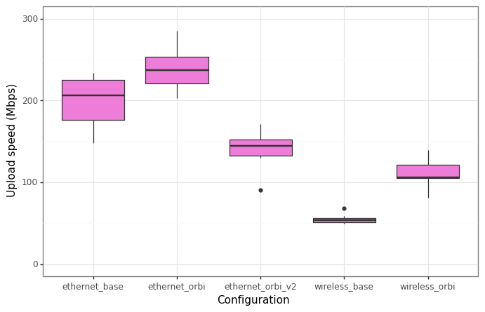

# Testing Wifi Speed 

## Background 

My building recently got fiber-optic cable installed, 
and my brother and I were able to finally switch over to a reliable WiFi provider. 
Our plan is now the 
[Verizon 1 Gig plan](https://www.verizon.com/home/fios-fastest-internet/), 
which supposedly offers speeds of "up to 940/880 Mbps". 
While we were paying for 1G speed with our last provider 
([Optimum's 1 GigFiber Internet plan](https://www.optimum.com/?utm_source=Google&utm_medium=bps&utm_campaign=Opt_Fixed_Google_Brand_InFootprint_Optimum_Core_Exact&bsp=optgmOCTsearchBrand914&off=1P39.99&s_cid=OptimumSEM1P39.99-_-gm-_-acq-_-bps-_-cpc-_-ggl-_-X-X-X-X&s_kwcid=AL!%3c9112%3e!3!596964362398!e!!g!!optimum%20wifi&gclsrc=aw.ds&gclid=CjwKCAjww8mWBhABEiwAl6-2RfzRJkAeVsQTRd8bMu_DVFu0vwxKNpmp-rKuio7wGLb6v5QOcHQt0hoCkNsQAvD_BwE)), 
we had consistent WiFi disconnects and speeds much lower than promised, 
so the switch to Verizon was pretty much required. 

During our time with Optimum, we bough the 
[Orbi Tri-band Mesh Wifi 6 System](https://www.netgear.com/home/wifi/mesh/rbk853/); 
it is an incredible device, and is a good setup since we can each put one of the satellites in our rooms. 
There is a "main" Orbi device that connects directly to your router, 
and two "satellites" that you plug somewhere else to boost your connection. 

With the new WiFi installed, we wanted to try and answer a few questions: 
1. Are we able to truly reach the maximum speed offered by our provider? 
2. Does the Orbi provide a significant boost to Wifi speed, either wireless or via ethernet? 
3. Does using wired connection through a satellite have the same impact as with the main Orbi? 

## Methodology 

Three accepted criteria of testing internet connection are download speed in Mbps 
(megabits per second), upload speed in Mbps, and ping (a.k.a. latency) in ms (milliseconds). 
A good summary of these can be found [here](https://www.speedtest.net/about/knowledge/glossary). 

The easiest and most convenient way was to use 
[Speedtest](https://www.speedtest.net), which provides estimates for the three criteria mentioned above. 
Testing was done on a 
[COOFUN Mini PC AMD Ryzen 7 3750H UM700](https://www.amazon.com/dp/B093BBLB4K?psc=1&ref=ppx_yo2ov_dt_b_product_details)
using 
[Speedtest's app for Windows 10](https://www.speedtest.net/apps/windows), 
and all testing was done in my bedroom. 
For wired connection, 
[DanYee Cat 7 Ethernet Cables](https://www.amazon.com/dp/B073RZNGQ5?psc=1&ref=ppx_yo2ov_dt_b_product_details)
were used. 

To answer the questions, the following configurations were used: 
- *wireless_base*: internet speed purely through Verizon's router. 
- *wireless_orbi*: wireless connection speed but having the WiFi boosted through the Orbi. 
- *ethernet_base*: wired connection with the ethernet cable plugged into the Verizon router. 
- *ethernet_orbi*: wired connection with the ethernet cable plugged into the main Orbi. 
- *ethernet_orbi_v2*: wired connection with the ethernet cable plugged into the satellite Orbi in my room. 

For a given configuration, 10 runs of the Speedtest test were recorded manually. 
Perhaps a more sophisticated test can be done using something like 
[speedtest-cli](https://github.com/sivel/speedtest-cli), but even for this small test 
we can get a lot of insight. 

## Relevant figures 

Below shows two relevant figures: 
- Box plots for the test results for each of the three criteria, split by each of the five configurations. 
- Tables showing the mean, median, and standard deviation of each of the tests. 

<figure>
    
    
    
    <!-- <figcaption> 
        Box plots of the results from each of the three tests. 
    </figcaption> -->
</figure>

Mean of test results: 
| Configuration    |   Download Speed (Mbps) |   Upload Speed (Mbps) |   Ping (ms) |
|:-----------------|------------------------:|----------------------:|------------:|
| ethernet_base    |                 911.481 |               199.451 |         4.1 |
| ethernet_orbi    |                 931.505 |               238.505 |         3.5 |
| ethernet_orbi_v2 |                 369.147 |               140.675 |         7.4 |
| wireless_base    |                  45.2   |                55.027 |         7.2 |
| wireless_orbi    |                 365.204 |               111.108 |         9   |

Median of test results: 
| Configuration    |   Download Speed (Mbps) |   Upload Speed (Mbps) |   Ping (ms) |
|:-----------------|------------------------:|----------------------:|------------:|
| ethernet_base    |                 931.215 |               206.455 |         4   |
| ethernet_orbi    |                 937.25  |               236.795 |         3   |
| ethernet_orbi_v2 |                 364.265 |               144.615 |         7.5 |
| wireless_base    |                  44.025 |                53.475 |         7   |
| wireless_orbi    |                 389.17  |               105.925 |         9.5 |

Standard deviation of test results: 
| Configuration    |   Download Speed (Mbps) |   Upload Speed (Mbps) |   Ping (ms) |
|:-----------------|------------------------:|----------------------:|------------:|
| ethernet_base    |                 45.5116 |              31.1031  |    2.02485  |
| ethernet_orbi    |                 14.0623 |              27.1253  |    0.849837 |
| ethernet_orbi_v2 |                 39.5545 |              21.7045  |    0.966092 |
| wireless_base    |                  6.5029 |               5.61764 |    1.22927  |
| wireless_orbi    |                 58.7189 |              16.7771  |    1.88562  |

## Conclusions 

Overall, it appears that the best possible configuration is the 
**wired connection to the main Orbi**. 
This configuration has (or at least is on par with) the highest download speed, highest upload speed, 
and lowest ping. 
When compared to the wired connection to the Verizon router, 
it also seems to be more consistent, in the sense that the results do not vary nearly as much, 
i.e. a much lower standard deviation. 

Several key inferences can be made regarding the entire experiment:  
- *The Orbi provides a significant boost in wireless connection over the basic router.* 
- *Using wired connection, it is possible to obtain speeds extremely close to the theoretical maximum.*
- *Using wired connection with the satellite Orbi does not offer any significant speed improvements over wireless.*

All of these results imply the following: 
1. The service offered by Verizon does in fact live up to its potential, at least when using wired connection. 
2. The Orbi only serves to improve its performance, especially for wireless connection. 